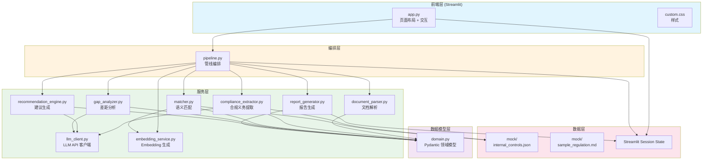
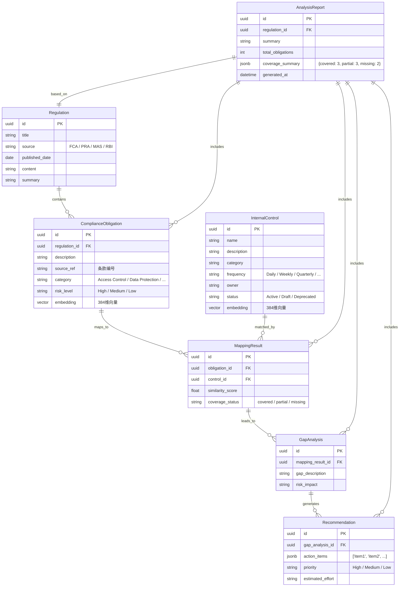
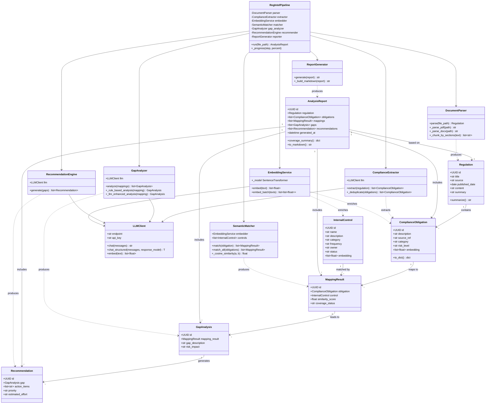
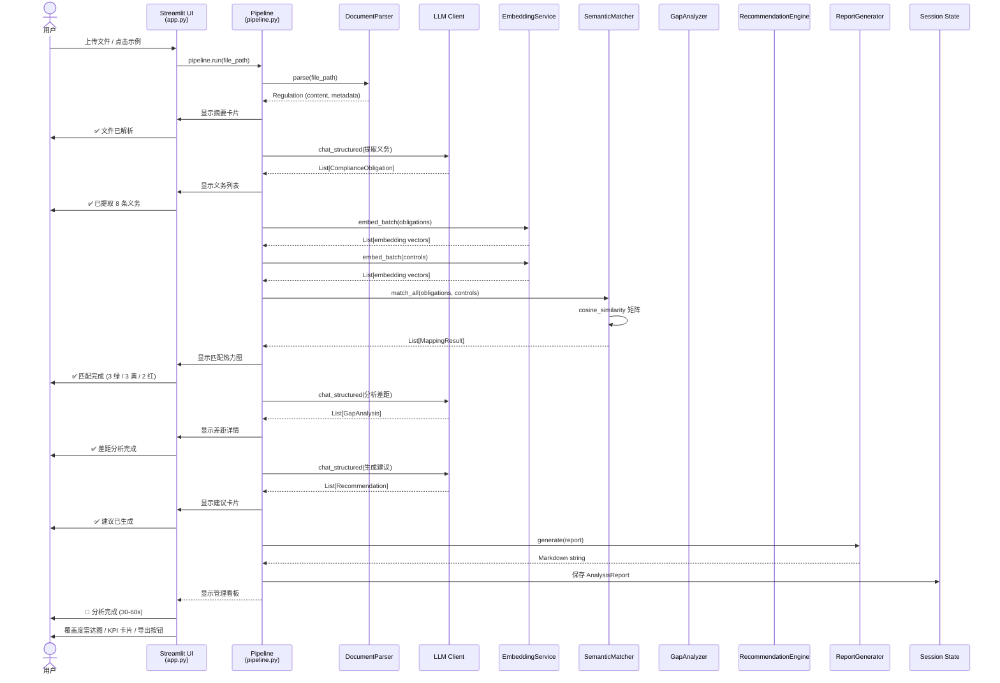
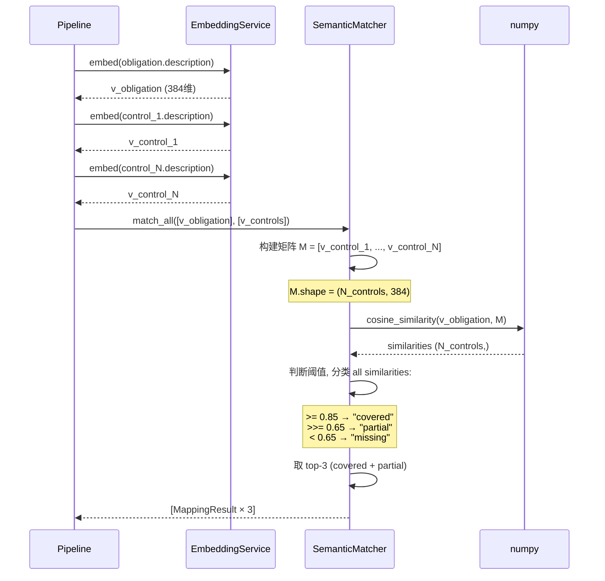
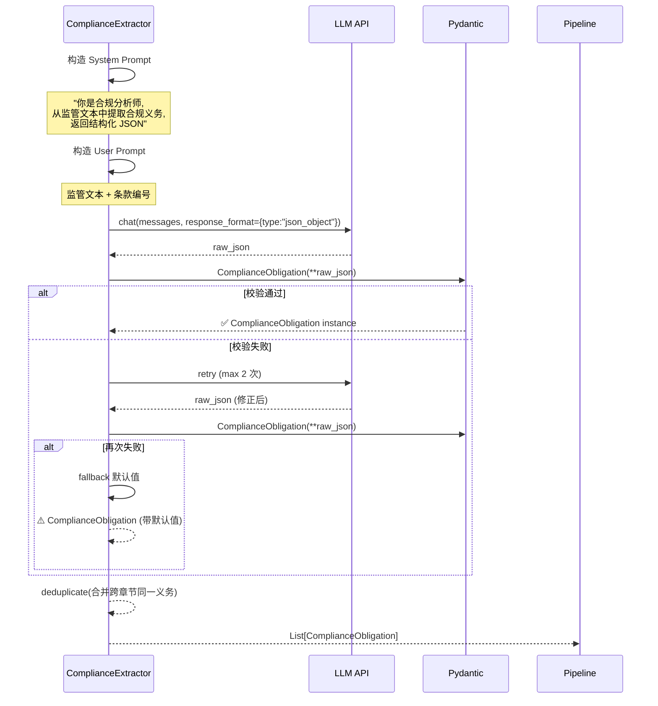
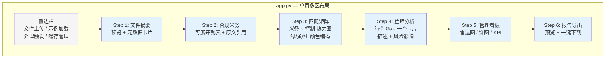

# RegIntel AI — v1 Detailed Design

> Streamlit + Session State + Mock Data 版本
> 快速原型，验证核心管线逻辑

---

## 一、系统模块与服务关系图



---

## 二、ER 图（数据模型关系）

v1 无数据库，数据存在于 Pydantic 对象和图中的 Streamlit Session State。以下展示各模型的逻辑关系：



> 注：`vector` 和 `jsonb` 是 v2 引入 PostgreSQL + pgvector 后的实际类型。v1 中对应为 `list[float]` 和 `dict`/`list`。

---

## 三、UML 类图



---

## 四、核心时序图

### 4.1 文件上传 → 分析完成（全流程）



### 4.2 语义匹配子流程



### 4.3 LLM 结构化输出子流程



---

## 五、Streamlit 页面结构



---

## 六、目录结构清单

```
regintel/
├── app.py                          # Streamlit 入口
├── config.py                       # 配置项
├── requirements.txt                # 依赖
├── README.md                       # 启动指南
│
├── services/
│   ├── __init__.py
│   ├── llm_client.py               # LLM API 客户端
│   ├── document_parser.py          # PDF/DOCX/TXT 解析
│   ├── compliance_extractor.py     # 合规义务提取
│   ├── embedding_service.py        # Embedding 生成
│   ├── matcher.py                  # 语义匹配 (numpy)
│   ├── gap_analyzer.py             # 差距分析
│   ├── recommendation_engine.py    # 建议生成
│   ├── report_generator.py         # 报告生成
│   └── pipeline.py                 # 管线编排
│
├── models/
│   ├── __init__.py
│   └── domain.py                   # Pydantic 数据模型
│
├── data/
│   ├── mock/
│   │   ├── internal_controls.json  # 25-30 条 Mock 内控
│   │   └── sample_regulation.md    # 模拟 FCA 监管文件
│   └── uploads/                    # 上传文件 (gitignore)
│
├── styles/
│   └── custom.css                  # Streamlit 自定义样式
│
├── tests/
│   ├── test_document_parser.py
│   ├── test_compliance_extractor.py
│   ├── test_matcher.py
│   └── test_gap_analyzer.py
│
└── design/
    └── v1/
        └── Detailed-Design.md      # 本文件
```

---

## 七、版本演进预留说明

v1 的目录结构已为 v2/v3 演进预留接口：

| v1 目录       | v2 变化                                 | v3 变化                    |
| ------------- | --------------------------------------- | -------------------------- |
| `app.py`    | → 替换为`app/main.py` (FastAPI)      | 不变                       |
| `styles/`   | → 替换为`static/` (FastAPI 静态文件) | 不变                       |
| `services/` | **不变，直接复用**                | **不变**             |
| `models/`   | **不变，直接复用**                | **不变**             |
| `data/`     | **不变**                          | **不变**             |
| —            | +`app/` 包 (FastAPI)                  | +`app/tasks.py` (Celery) |
| —            | +`db/` (PostgreSQL init)              | +`dags/` (Airflow)       |
| —            | +`Dockerfile`, `docker-compose.yml` | +`playbooks/` (Ansible)  |

核心原则：**services/、models/、data/ 三个目录在 v1 → v3.1 演进中不作改写，只新增不删改。**

---

## 修订记录

| 版本 | 日期       | 变更说明                                              |
| ---- | ---------- | ----------------------------------------------------- |
| v1.0 | 2026-06-29 | 初版详细设计：系统模块图/ER图/UML类图/时序图/页面结构 |
